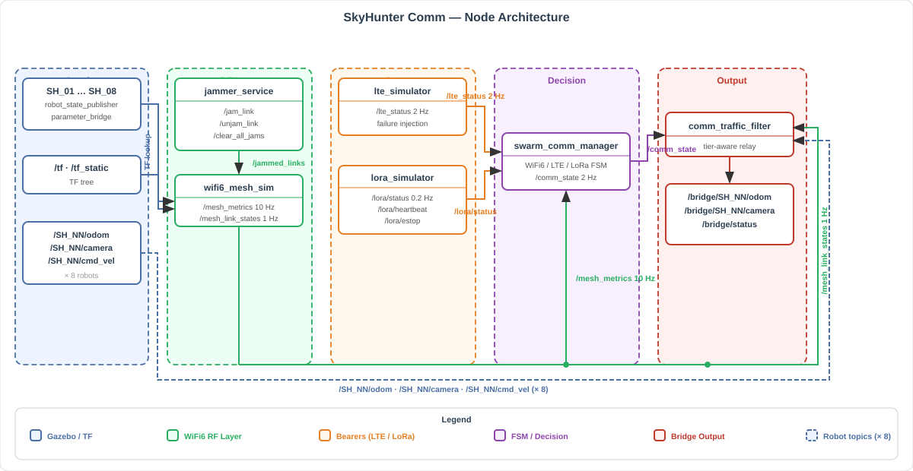
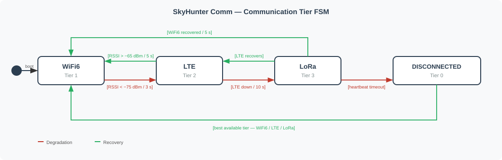

# skyhunter_comm

Communication stack for the SkyHunter 8-robot UGV swarm simulation. Implements a 3-tier RF failover system — **WiFi6 mesh → LTE → LoRa** — with simulated RF propagation, dynamic link quality, jammer injection, and tier-aware traffic filtering.

---

## Architecture





---

## Package Structure

```
skyhunter_comm/
├── package.xml
├── CMakeLists.txt
├── setup.py
│
├── skyhunter_comm/                     # Python source
│   ├── __init__.py
│   ├── wifi6_mesh_sim.py               # Node 1 — WiFi6 RF simulation
│   ├── jammer_service.py               # Node 2 — Standalone jammer
│   ├── swarm_comm_manager.py           # Node 3 — Failover FSM
│   ├── lte_simulator.py                # Node 4 — LTE stub
│   ├── comm_traffic_filter.py          # Node 5 — Traffic filter / bridge
│   ├── lora_simulator.py               # Node 6 — LoRa stub
│   └── models/
│       ├── __init__.py
│       ├── robot_discovery.py          # TF-based auto-discovery
│       ├── path_loss.py                # Log-distance RF model
│       ├── comm_fsm.py                 # Pure-Python FSM (unit-testable)
│       ├── health_evaluators.py        # WiFi6 / LTE / LoRa health checks
│       ├── lte_model.py                # LTE RTT + loss model
│       ├── lora_model.py               # LoRa duty cycle + packet model
│       └── traffic_policy.py           # Per-tier relay policies
│
├── config/
│   └── skyhunter_comm.yaml             # All node parameters (single source of truth)
│
├── launch/
│   └── networking.launch.py            # Full stack launch (all 6 nodes)
│
└── test/
    ├── test_failover.py                # L8b — WiFi6→LTE failover (V&V 2.5)
    ├── test_delay.py                   # L7b — Delay injection
    ├── test_packet_loss.py             # L7b — Packet loss model
    └── test_jammer.py                  # L7b — Jammer service
```

---

## Nodes

### `wifi6_mesh_sim`
Simulates an 802.11s WiFi6 mesh network across all robots. Computes inter-robot distances via TF2 lookups, applies a log-distance path loss model, and publishes per-link metrics at 10 Hz. Auto-discovers robots from the TF tree — no hardcoded `num_robots`.

| | |
|---|---|
| **Subscribes** | `/jammed_links` |
| **Publishes** | `/mesh_metrics` (10 Hz), `/mesh_link_states` (1 Hz) |
| **Config** | `skyhunter_comm.yaml` → `wifi6_mesh_sim` |

---

### `jammer_service`
Standalone RF jamming management service. Applies configurable attenuation to specific robot-pair links, supports timed expiry, and publishes the current jam state at 10 Hz. Fully decoupled from `wifi6_mesh_sim` so any node or test script can call it independently.

| | |
|---|---|
| **Publishes** | `/jammed_links` (10 Hz) |
| **Services** | `/jam_link`, `/unjam_link`, `/clear_all_jams` |
| **Config** | `skyhunter_comm.yaml` → `jammer_service` |

---

### `swarm_comm_manager`
The FSM brain of the comm stack. Monitors WiFi6, LTE, and LoRa health continuously and transitions between tiers using hysteresis timers to prevent flapping.

| Transition | Trigger |
|---|---|
| WiFi6 → LTE | WiFi6 degraded for `wifi6_fail_duration_s` (default 3 s) |
| LTE → WiFi6 | WiFi6 recovered for `wifi6_recovery_duration_s` (default 5 s) + no active jams |
| LTE → LoRa | LTE down for `lte_fail_duration_s` (default 10 s) |
| Any → WiFi6 | WiFi6 RSSI above `wifi6_recovery_rssi` (default −65 dBm) sustained |

| | |
|---|---|
| **Subscribes** | `/mesh_metrics`, `/lte_status`, `/lora/status` |
| **Publishes** | `/comm_state` (2 Hz) |
| **Config** | `skyhunter_comm.yaml` → `swarm_comm_manager` |

---

### `lte_simulator`
Simulates an LTE bearer with configurable RTT, packet loss, and bandwidth. Supports failure injection via service call for testing LTE→LoRa fallover scenarios.

| | |
|---|---|
| **Publishes** | `/lte_status` (2 Hz) |
| **Services** | `/lte/inject_failure` |
| **Config** | `skyhunter_comm.yaml` → `lte_simulator` |

---

### `comm_traffic_filter`
Tier-aware traffic shaper. Subscribes to all 8 robot topics and applies relay policies based on the current communication tier from `/comm_state`. Publishes aggregated data to `/bridge/SH_NN/*` topics.

| | |
|---|---|
| **Subscribes** | `/comm_state`, `/SH_NN/odom`, `/SH_NN/rgb_camera/image_raw`, `/SH_NN/cmd_vel` |
| **Publishes** | `/bridge/SH_NN/odom`, `/bridge/SH_NN/rgb_camera/image_raw`, `/bridge/status` |
| **Config** | `skyhunter_comm.yaml` → `comm_traffic_filter` |

---

### `lora_simulator`
Simulates a LoRa long-range radio link with duty cycle enforcement, spreading factor modeling, and e-stop relay capability. Publishes staggered per-robot heartbeats and responds to e-stop service calls.

| | |
|---|---|
| **Publishes** | `/lora/heartbeat`, `/lora/status` (0.2 Hz), `/lora/estop` |
| **Services** | `/lora/send_estop`, `/lora/inject_failure` |
| **Config** | `skyhunter_comm.yaml` → `lora_simulator` |

---

## Topic Reference

### Published Topics

| Topic | Type | Rate | Publisher |
|-------|------|------|-----------|
| `/mesh_metrics` | `skyhunter_msgs/MeshMetrics` | 10 Hz | `wifi6_mesh_sim` |
| `/mesh_link_states` | `skyhunter_msgs/MeshLinkStates` | 1 Hz | `wifi6_mesh_sim` |
| `/jammed_links` | `skyhunter_msgs/JammedLinks` | 10 Hz | `jammer_service` |
| `/lte_status` | `skyhunter_msgs/LteStatus` | 2 Hz | `lte_simulator` |
| `/lora/status` | `skyhunter_msgs/LoraStatus` | 0.2 Hz | `lora_simulator` |
| `/lora/heartbeat` | `skyhunter_msgs/LoraHeartbeat` | ~1.6 Hz | `lora_simulator` |
| `/lora/estop` | `skyhunter_msgs/LoraEstop` | On trigger | `lora_simulator` |
| `/comm_state` | `skyhunter_msgs/CommState` | 2 Hz | `swarm_comm_manager` |
| `/bridge/SH_NN/odom` | `nav_msgs/Odometry` | Tier-dependent | `comm_traffic_filter` |
| `/bridge/SH_NN/rgb_camera/image_raw` | `sensor_msgs/Image` | Tier-dependent | `comm_traffic_filter` |
| `/bridge/status` | `std_msgs/String` | 1 Hz | `comm_traffic_filter` |

### Services

| Service | Type | Provider | Purpose |
|---------|------|----------|---------|
| `/jam_link` | `skyhunter_msgs/JamLink` | `jammer_service` | Apply RF attenuation to a robot pair |
| `/unjam_link` | `skyhunter_msgs/UnjamLink` | `jammer_service` | Remove jam from a robot pair |
| `/clear_all_jams` | `std_srvs/Trigger` | `jammer_service` | Clear all active jams |
| `/lte/inject_failure` | `skyhunter_msgs/InjectFailure` | `lte_simulator` | Force LTE failure for testing |
| `/lora/send_estop` | `skyhunter_msgs/SendEstop` | `lora_simulator` | Broadcast e-stop via LoRa |
| `/lora/inject_failure` | `skyhunter_msgs/InjectFailure` | `lora_simulator` | Force LoRa failure for testing |

---

## Communication Tier FSM



---

## Configuration

All parameters live in `config/skyhunter_comm.yaml` — one file for all 6 nodes.

Robot namespace parameters (`ns_prefix`, `num_robots`) are passed as launch arguments — `ns_prefix` defaults to `SH` and produces namespaces `SH_01`...`SH_08`. These are declared in `skyhunter_bringup` launchers and forwarded to `skyhunter_gazebo`. There is no `robot_params.yaml` — launch args are the single source of truth.

Key parameters:

| Parameter | Default | Description |
|-----------|---------|-------------|
| `wifi6_mesh_sim.path_loss_exponent` | `2.8` | RF propagation exponent |
| `wifi6_mesh_sim.disconnect_threshold_dbm` | `−85.0` | RSSI floor for link disconnect |
| `swarm_comm_manager.wifi6_rssi_fail_threshold` | `−75.0` | RSSI below which WiFi6 is failing |
| `swarm_comm_manager.wifi6_recovery_rssi` | `−65.0` | RSSI required for WiFi6 recovery |
| `swarm_comm_manager.wifi6_fail_duration_s` | `3.0` | Hysteresis window for WiFi6 → LTE |
| `swarm_comm_manager.wifi6_recovery_duration_s` | `5.0` | Hysteresis window for LTE → WiFi6 |
| `swarm_comm_manager.lte_timeout_s` | `10.0` | Hysteresis window for LTE → LoRa |
| `lte_simulator.base_rtt_ms` | `50.0` | Baseline LTE round-trip time |
| `lora_simulator.duty_cycle_limit` | `0.01` | Max LoRa air-time fraction (1%) |
| `lora_simulator.spreading_factor` | `10` | LoRa SF — range vs. data rate trade-off |

---

## Dependencies

| Package | Role |
|---------|------|
| `skyhunter_msgs` | All custom message and service definitions |
| `skyhunter_gazebo` | Runtime — `comm_traffic_filter` subscribes to robot topics published by Gazebo bridges |
| `skyhunter_bringup` | Provides `common_config.launch.py` (DDS env vars, domain ID) |

---

## Usage

**Launch the full networking stack:**
```bash
ros2 launch skyhunter_comm networking.launch.py
```

**Verify all nodes are up:**
```bash
ros2 node list | grep -E "wifi6|jammer|swarm_comm|lte|lora|comm_traffic"
```

**Monitor communication tier:**
```bash
ros2 topic echo /comm_state
```

**Manually jam a robot-pair link:**
```bash
ros2 service call /jam_link skyhunter_msgs/srv/JamLink \
  '{robot_a: "1", robot_b: "2", attenuation_db: 60.0}'
```

**Clear all active jams:**
```bash
ros2 service call /clear_all_jams std_srvs/srv/Trigger '{}'
```

**Inspect per-link RF metrics:**
```bash
ros2 topic echo /mesh_metrics --once
```

---

## Build

```bash
colcon build --packages-select skyhunter_msgs skyhunter_comm
source install/setup.bash
```

---

## Testing

| Script | Task | V&V |
|--------|------|-----|
| `test_all.py` | Runner — executes all comm tests sequentially | — |
| `test_delay.py` | Delay injection validation (5–20 ms range, 100+ samples) | V&V 2.1 |
| `test_packet_loss.py` | Packet loss model — RSSI + loss vs. distance | V&V 2.2 |
| `test_jammer.py` | Jammer — baseline vs. jammed link metrics | V&V 2.3 |
| `test_failover.py` | WiFi6→LTE via jammer, hold jammed, recovery | V&V 2.5 |
| `test_bridge_relay.py` | 8-robot bridge relay + auto LTE switch | V&V 2.6 |
| `test_full_chain.py` | Full 3-tier chain + recovery + rapid cycling | V&V 3.0 |
| `test_bridge_stress.py` | Bridge stress test — 8 robots, CPU/RAM | V&V L11 |
| `test_3tier_failover.py` | Full 3-tier formal failover | V&V 3.1 |
| `test_lora_estop.py` | LoRa e-stop relay + sustained stress | V&V 3.2 |
| `test_latency.py` | Comm latency 1000+ samples per tier | V&V L16 |

```bash
# Run all tests
python3 test/test_all.py

# Run subset
python3 test/test_all.py --tests 2.1 2.2 2.3

# Run individual tests
ros2 run skyhunter_comm test_failover
ros2 run skyhunter_comm test_delay
ros2 run skyhunter_comm test_packet_loss
ros2 run skyhunter_comm test_jammer
ros2 run skyhunter_comm test_bridge_relay
ros2 run skyhunter_comm test_full_chain
ros2 run skyhunter_comm test_bridge_stress
```

---

## Related Documents

| Document | Description |
|----------|-------------|
| `WiFi6_Mesh_Design.md` | 802.11ax + 802.11s mesh architecture |
| `802.11s_Config_Spec.md` | hostapd/wpa_supplicant channel configuration |
| `wifi6_mesh_sim_Architecture.md` | Node design and RF model internals |
| `LoRa_Emergency_Link_Spec.md` | LoRa duty cycle, payload format, and e-stop protocol |
| `Network_Architecture_Final.md` | Full system network architecture |