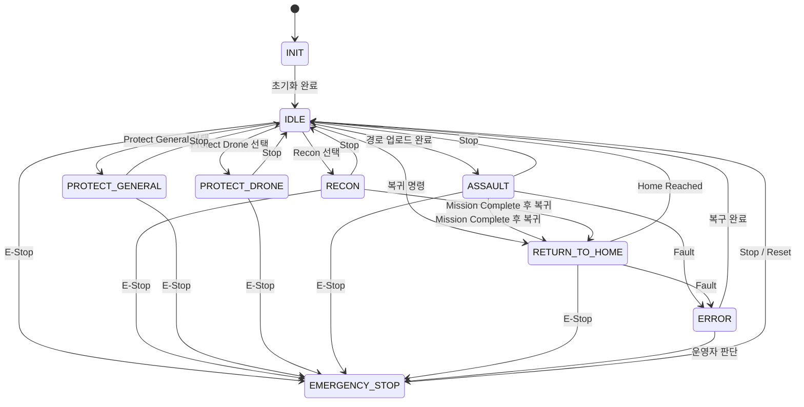

# 앱 연동 상태전이 문서

## 1. 문서 목적

이 문서는 최종 제품 기준의 앱 상태전이와 로봇 운용 흐름을 정의한다.

핵심 기준:

- 제품 UI는 `Recon`, `Protect`, `Assault`, `E-Stop` 중심으로 구성한다.
- `Assault`는 최종 제품에서 `Mission`만 제공한다.
- `Assault Tracking`은 디버그 전용이다.
- `Assault Manual`은 제거한다.
- 앱의 이동 명령은 leader robot에만 전달한다.
- follower robot의 이동 상태는 leader relay에 의해 파생된다.
- follower robot의 상태 정보는 leader robot이 집계해 앱에 전달한다.
- `Ready`, `Moving`, `Paused`, `Reached`는 모드 상태가 아니라 `Mission Status`다.

## 2. 제품 기준 모드 목록

| 모드 | 설명 |
| --- | --- |
| `INIT` | 시스템 초기화 중 |
| `IDLE` | 대기 상태 |
| `RECON` | 이동 및 정찰 |
| `PROTECT_GENERAL` | 일반 감시 |
| `PROTECT_DRONE` | 드론 감시 |
| `ASSAULT` | 경로 기반 임무 수행 |
| `RETURN_TO_HOME` | 초기 출발지 복귀 |
| `EMERGENCY_STOP` | 긴급 정지 |
| `ERROR` | 시스템 또는 미션 오류 |

## 3. Mission Status 목록

| mission_status | 설명 |
| --- | --- |
| `NONE` | 세부 수행 상태 없음 |
| `READY` | 수행 준비 완료 |
| `MOVING` | 이동 또는 임무 수행 중 |
| `PAUSED` | 일시정지 |
| `REACHED` | 목표 도달 또는 완료 |
| `ERROR` | 세부 수행 오류 |

## 4. 제품 UI 기준 상태전이

Leader 제어 전제:

- `RECON`, `PROTECT_*`, `ASSAULT`, `RETURN_TO_HOME` 진입은 leader robot 제어 화면에서 수행한다.
- follower robot은 직접 상태전이 명령을 받지 않고 leader 명령에 따라 종속 전이한다.
- 앱에 표시되는 follower robot의 상태도 leader robot이 집계한 값을 사용한다.

## 5. 모드별 앱 동작 정의

## 5.1 INIT

- 앱은 모든 조작 버튼을 잠근다.
- 연결 상태와 초기화 진행 상태만 표시한다.
- 초기화 완료 후 `IDLE`로 전환한다.

## 5.2 IDLE

- 모든 기능 진입의 기준 상태
- 사용자는 `Recon`, `Protect`, `Assault` 중 하나를 선택할 수 있다.
- `E-Stop` 버튼은 항상 활성화한다.

## 5.3 RECON

- 주행 조작 허용
- route setup 허용
- waypoint add/delete/reorder/reset/finish 허용
- 짐벌 수동 조작 허용
- 줌 조작 허용
- `Stop` 시 `IDLE` 복귀
- 주행 시작은 leader robot 기준으로만 수행
- follower robot은 leader의 formation relay를 따라 이동
- follower robot의 `mode`, `mission_status`, `battery`, `error`는 leader 집계 상태로 표시
- 세부 상태는 `Mission Status`로 `Ready/Moving/Paused/Reached/Error`를 사용한다.
- mission 완료 후 `RETURN_TO_HOME` 진입이 가능하다.

## 5.4 PROTECT_GENERAL / PROTECT_DRONE

- 자동 감시 동작
- 타겟 탐지 시 조준점 표시
- 운용자는 탐지 상황을 모니터링
- `Stop` 시 `IDLE` 복귀
- 필요 시 감시 준비/수행/오류는 `Mission Status`로 표시한다.
- follower robot의 감시 상태도 leader 집계 상태로 표시한다.

## 5.5 ASSAULT

- waypoint 경로 기반 mission 수행
- 현재 waypoint, 전체 waypoint, 잔여 거리 표시
- 경로는 leader robot 기준 master mission으로 관리
- follower robot의 slot 유지, mode, mission_status, error는 leader 집계 상태로 표시
- 세부 진행 상태는 `Mission Status`로 표시한다.
- `Ready`, `Moving`, `Paused`, `Reached`, `Error`는 Assault의 하위 모드가 아니다.
- mission 완료 후 `RETURN_TO_HOME` 진입이 가능하다.

## 5.6 RETURN_TO_HOME

- 초기 출발지(home position)로 복귀하는 모드
- `Recon` 또는 `Assault` 종료 후 사용
- leader robot 기준 저장된 출발 좌표를 목표로 복귀
- follower robot은 복귀 formation을 유지
- follower robot의 복귀 진행 상태도 leader 집계 상태로 표시한다.
- 세부 진행 상태는 `Mission Status`로 표시한다.

## 5.7 EMERGENCY_STOP

- 모든 일반 제어 잠금
- 화면 전체에 안전 상태 강조 표시
- 복귀는 운영자 확인 후 `Stop/Reset`으로 수행

## 5.8 ERROR

- 오류 사유 표시
- 자동 복구 또는 운용자 복귀 절차 수행
- 필요 시 `E-Stop`으로 전환

## 6. 전이 이벤트 정의

| 이벤트 | 설명 | 결과 |
| --- | --- | --- |
| `init_complete` | 시스템 초기화 완료 | `INIT -> IDLE` |
| `select_recon` | 사용자가 Recon 선택 | `IDLE -> RECON` |
| `select_protect_general` | 사용자가 Protect General 선택 | `IDLE -> PROTECT_GENERAL` |
| `select_protect_drone` | 사용자가 Protect Drone 선택 | `IDLE -> PROTECT_DRONE` |
| `load_path_success` | 경로 업로드 성공 | `IDLE -> ASSAULT` |
| `return_to_home` | 복귀 명령 실행 | `IDLE/RECON/ASSAULT -> RETURN_TO_HOME` |
| `home_reached` | 출발지 복귀 완료 | `RETURN_TO_HOME -> IDLE` |
| `stop` | 일반 정지 | 각 운용 상태 -> `IDLE` |
| `fault` | 장치 또는 시스템 오류 | 운용 상태 -> `ERROR` |
| `estop` | 긴급 정지 | 모든 상태 -> `EMERGENCY_STOP` |
| `reset` | 긴급정지 해제 | `EMERGENCY_STOP -> IDLE` |

follower 파생 이벤트:

| 이벤트 | 설명 | 결과 |
| --- | --- | --- |
| `leader_route_assigned` | leader가 formation/route slot 할당 | follower 준비 상태 진입 |
| `leader_motion_start` | leader가 이동 시작 | follower 이동 시작 |
| `leader_motion_pause` | leader가 일시정지 | follower 정지 또는 hold |
| `leader_estop` | leader가 긴급정지 전파 | follower 즉시 정지 |

Mission Status 이벤트:

| 이벤트 | 적용 모드 | mission_status 변화 |
| --- | --- | --- |
| `mission_ready` | `RECON`, `PROTECT_*`, `ASSAULT`, `RETURN_TO_HOME` | `NONE -> READY` |
| `mission_start` | `RECON`, `ASSAULT`, `RETURN_TO_HOME` | `READY -> MOVING` |
| `mission_pause` | `RECON`, `ASSAULT`, `RETURN_TO_HOME` | `MOVING -> PAUSED` |
| `mission_resume` | `RECON`, `ASSAULT`, `RETURN_TO_HOME` | `PAUSED -> MOVING` |
| `mission_complete` | `RECON`, `ASSAULT`, `RETURN_TO_HOME` | `MOVING -> REACHED` |
| `mission_error` | 모든 수행 모드 | `* -> ERROR` |

## 7. 앱 버튼과 상태전이 매핑

| 앱 버튼 | 현재 상태 | 다음 상태 |
| --- | --- | --- |
| `Recon` | `IDLE` | `RECON` |
| `Protect General` | `IDLE` | `PROTECT_GENERAL` |
| `Protect Drone` | `IDLE` | `PROTECT_DRONE` |
| `Load Path` | `IDLE`, `ASSAULT` | `ASSAULT` |
| `Start` | `RECON`, `ASSAULT` | 모드 유지, `mission_status=Moving` |
| `Return to Home` | `RECON`, `ASSAULT`, `IDLE` | `RETURN_TO_HOME` |
| `Pause` | `RECON`, `ASSAULT`, `RETURN_TO_HOME` | 모드 유지, `mission_status=Paused` |
| `Resume` | `RECON`, `ASSAULT`, `RETURN_TO_HOME` | 모드 유지, `mission_status=Moving` |
| `Stop` | `RECON`, `PROTECT_*`, `ASSAULT`, `RETURN_TO_HOME`, `EMERGENCY_STOP` | `IDLE` |
| `E-Stop` | 모든 상태 | `EMERGENCY_STOP` |
| `Stream Start` | 모든 운용 화면 | 모드 유지, 고정 파이프라인 시작 |
| `Stream Stop` | 모든 운용 화면 | 모드 유지, 고정 파이프라인 정지 |

제약 조건:

- 위 버튼들은 leader robot 선택 상태에서만 활성화한다.
- follower robot 상세 화면에서는 leader robot이 집계한 상태 모니터링만 허용하고 이동 버튼은 비활성화한다.

## 8. 내부 구현과의 매핑

현재 코드 기준 내부 상태는 아래와 같이 대응시킨다.

| 제품 상태 | 현재 구현 상태 |
| --- | --- |
| `INIT` | `INIT_STATE` |
| `IDLE` | `IDLE` |
| `RECON` | `MOVE_STATE` |
| `PROTECT_GENERAL` | `SURVEILLANCE_STATE` |
| `PROTECT_DRONE` | `DRONE_SURVEILLANCE_STATE` |
| `ASSAULT` | `ASSAULT_STATE` |
| `RETURN_TO_HOME` | `RTH_STATE` |
| `EMERGENCY_STOP` | `EMERGENCY_STOP_STATE` |
| `ERROR` | `ERROR_STATE` |

Mission Status 매핑:

| 제품 Mission Status | 현재 구현 후보 |
| --- | --- |
| `READY` | `assault_status=READY` 또는 path loaded 상태 |
| `MOVING` | `assault_status=MOVING` |
| `PAUSED` | `assault_status=PAUSED` |
| `REACHED` | `assault_status=REACHED` |
| `ERROR` | `assault_status=ERROR` |

디버그 상태:

| 내부 상태 | 제품 노출 |
| --- | --- |
| `TRACKING_STATE` | 숨김 |
| `ATTACKING_STATE` | 미사용 예정 |

## 9. 제품 운용 정책

- 앱 메인 메뉴에는 `Assault` 하나만 둔다.
- `Return to Home`는 임무 종료 후 복귀 기능으로 별도 제공한다.
- `Assault` 화면에서 수동 조준/Tracking 토글을 제공하지 않는다.
- Tracking 관련 상태값이 수신되더라도 일반 제품 UI에서는 `Debug` 또는 숨김 처리한다.
- 미션 화면은 항상 `Path Load -> mode=Assault + missionStatus=Ready -> Start -> missionStatus=Moving` 흐름을 강제한다.
- `Return to Home`는 `Recon` 또는 `Assault` 완료 후 출발지 복귀 용도로 사용한다.
- 스트리밍은 고정 파이프라인이므로 품질 변경 UI를 두지 않는다.
- 스트리밍 제어는 `start/stop`만 제공한다.
- follower robot 상태 표시는 leader robot이 전달한 집계 상태만 사용한다.

## 10. 예외 처리

### 10.1 경로 미업로드 상태에서 Assault 진입

- `Start` 버튼 비활성화
- `Load Path First` 메시지 노출

### 10.2 home position 없는 상태에서 Return to Home 실행

- `Return to Home` 버튼 비활성화
- `Home Position Not Available` 메시지 노출

### 10.3 상태 채널 단절

- 현재 상태를 `Unknown`으로 표시
- `E-Stop`을 제외한 주요 조작 잠금

### 10.4 미션 오류 발생

- 상태를 `ERROR`로 표시
- 오류 코드와 마지막 waypoint 정보를 표시
- `Stop` 또는 `Idle 복귀` 유도
