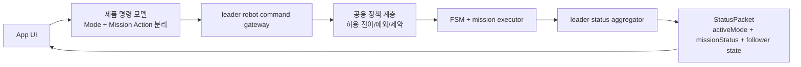

# `robot_server` 선차단 구현과 개발 계획 비교

## 목적

이 문서는 현재 `robot_server`에 추가한 mode 선차단 로직을 기준으로, 아래 두 수준의 목표와 비교했을 때 아직 부족한 부분을 정리한다.

비교 기준 문서:

- 단기 기준: `docs/app_integration/phase1_robot_server_main_operator_todo.md`
- 최종 기준: `docs/app_integration/app_unified_spec.md`
- 최종 상태전이 기준: `docs/app_integration/app_fsm.md`
- 최종 운용 기준: `docs/app_integration/operation_scenario.md`
- 인터페이스 기준: `docs/app_integration/app_interface_spec.md`

비교 대상 구현:

- `ros/src/skyautonet/combat_robot_system/robot_server/src/command_server.cpp`

---


### 1.1 오늘 결정된 transport-layer 동작 메모

오늘 기준 `robot_server` 선차단 정책은 아래처럼 정리한다.

- `ESTOP`, `RETURN_TO_HOME`, `IDLE`는 항상 publish 허용
- 그 외 기능 모드는 non-idle 상태에서 새 mode로 바꾸지 않음
- 차단 시 패킷 전체를 버리지 않고 `command_id`만 현재 상태 대응 값으로 유지
- 따라서 `pan/tilt`, `zoom`, `stream_command`는 그대로 전달
- 별도 태블릿 테스트 서버(`combatrobotcontroller/src/robot_server_rknn.cpp`)는 이 정책과 별개로 `S1..S8` 집계 상태, numeric robot ID, formation preset, dummy telemetry를 앱 검증용으로 제공
## 1. 현재 반영된 선차단 구조

현재 `robot_server`는 `operation_state_`를 보고 mode 전환 허용 여부를 판단한다.

- 항상 허용: `ESTOP`, `RETURN_TO_HOME`, `IDLE`
- 그 외 기능 모드:
  - 현재 `operation_state == IDLE`이면 허용
  - `IDLE`이 아니면 요청한 `command_id`를 현재 상태에 대응하는 값으로 덮어쓴 뒤 publish

관련 코드:

- `ros/src/skyautonet/combat_robot_system/robot_server/src/command_server.cpp:27`
- `ros/src/skyautonet/combat_robot_system/robot_server/src/command_server.cpp:37`
- `ros/src/skyautonet/combat_robot_system/robot_server/src/command_server.cpp:628`

### 현재 흐름 그림

```mermaid
flowchart TD
    A[App StateCommand 수신] --> B[robot_server<br/>command_id 매핑]
    B --> C{현재 operation_state가 IDLE인가?}
    C -->|예| D[요청 command_id 그대로 publish]
    C -->|아니오 + ESTOP/RTH/IDLE| E[예외 명령 그대로 publish]
    C -->|아니오 + 기타 기능 명령| F[현재 상태 대응 command_id로 덮어쓰기]
    F --> G[/user_command publish]
    D --> G
    E --> G
```

이 로직은 “현재 기능이 끝나서 `IDLE`로 돌아오기 전에는 다른 일반 기능으로 넘어가지 않게 한다”는 단기 목적에는 맞는다.

---

## 2. 1차 개발 계획 대비 부족한 부분

`phase1_robot_server_main_operator_todo.md` 기준으로 보면 현재 구현은 방어막 하나를 추가한 수준이고, 아래 항목은 아직 남아 있다.

### 2.1 제품 명령 체계 정리가 끝나지 않음

1차 계획은 제품 기준 command id 체계 정리와 debug 명령 분리를 요구한다.

- `docs/app_integration/phase1_robot_server_main_operator_todo.md:33`
- `docs/app_integration/phase1_robot_server_main_operator_todo.md:34`
- `docs/app_integration/phase1_robot_server_main_operator_todo.md:66`

하지만 현재 구현은 여전히 `command_id == 6`을 `ASSAULT`가 아니라 `DEBUG_TRACKING`으로 임시 매핑한다.

- `ros/src/skyautonet/combat_robot_system/robot_server/src/command_server.cpp:621`

즉, gate는 생겼지만 제품 명령 체계는 아직 정리되지 않았다.

### 2.2 앱이 hold 사실을 명시적으로 알 수 없음

현재는 차단 시 `command_id`를 현재 상태 값으로 덮어쓴 뒤 publish만 한다. 앱으로는 reject reason, held flag, denied transition 같은 명시적 신호가 내려가지 않는다.

그래서 앱은 아래 두 경우를 구분하기 어렵다.

- 명령이 수락되었지만 상태 반영이 늦는 경우
- `robot_server`가 의도적으로 mode 변경을 보류한 경우

이는 1차 계획의 “앱이 오인하지 않도록 기준을 명확히 하라”는 요구에 아직 못 미친다.

### 2.3 `robot_server` 정책 테스트가 없음

현재 테스트는 FSM 중심이고, `robot_server` 선차단 정책은 직접 검증하지 않는다.

- `ros/src/skyautonet/combat_robot_system/combat_robot_operation_system/test/test_fsm_transitions.cpp:206`
- `ros/src/skyautonet/combat_robot_system/combat_robot_operation_system/test/test_fsm_transitions.cpp:220`
- `ros/src/skyautonet/combat_robot_system/combat_robot_operation_system/test/test_fsm_transitions.cpp:248`
- `ros/src/skyautonet/combat_robot_system/combat_robot_operation_system/test/test_fsm_transitions.cpp:361`

아직 없는 검증:

- non-idle 상태에서 일반 mode 변경 hold
- hold 시 `pan/tilt`, `zoom`, `stream_command` 유지
- `ESTOP`, `RTH`, `IDLE` 예외 유지

### 2.4 현재 상태 유지용 역매핑 규칙이 문서화되어 있지 않음

지금 구현은 상태 유지용으로 아래 역매핑을 사용한다.

- `MOVE -> RECON`
- `SURVEILLANCE -> PROTECT_GENERAL`
- `DRONE_SURVEILLANCE -> PROTECT_DRONE`
- `TRACKING -> DEBUG_TRACKING`
- `EMERGENCY_STOP -> ESTOP`

관련 코드:

- `ros/src/skyautonet/combat_robot_system/robot_server/src/command_server.cpp:37`

이 규칙은 실용적이지만 1차 계획 문서에는 없어서, 현재 동작과 문서 계약 사이에 간격이 남아 있다.

---

## 3. 최종 목표 대비 부족한 부분

최종 목표 문서들을 보면, 현재 mode gate는 전체 제품 구조 중 아주 작은 일부만 충족한다.

### 3.1 최종 제품은 mode gate보다 큰 미션 흐름을 요구함

최종 문서는 `Recon`, `Protect`, `Assault`, `Return to Home`, `E-Stop`만이 아니라 `Mission Status`와 `Path` lifecycle까지 포함한다.

- `docs/app_integration/app_unified_spec.md:13`
- `docs/app_integration/app_unified_spec.md:15`
- `docs/app_integration/app_fsm.md:43`
- `docs/app_integration/app_fsm.md:193`

현재 `robot_server`는 Path 채널에서 `LOAD_PATH/START/PAUSE/RESUME/STOP`을 받으면 내부 카운터와 `mission_status_`만 바꾸고 있다.

- `ros/src/skyautonet/combat_robot_system/robot_server/src/command_server.cpp:424`
- `ros/src/skyautonet/combat_robot_system/robot_server/src/command_server.cpp:427`
- `ros/src/skyautonet/combat_robot_system/robot_server/src/command_server.cpp:436`
- `ros/src/skyautonet/combat_robot_system/robot_server/src/command_server.cpp:448`

즉 현재는:

- mode gate는 있음
- 하지만 최종 목표의 `Path Load -> Assault + Ready -> Start -> Moving -> Pause/Resume -> Reached` 흐름을 실제 제어하지는 않음
- `mission_status`가 실제 FSM/mission executor 상태가 아니라 `robot_server` 내부 placeholder로도 바뀔 수 있음

이 점은 최종 목표와 가장 큰 차이다.

### 3.2 `Return to Home` 전제가 구현 구조에 없음

최종 문서는 `Return to Home`를 `Recon` 또는 `Assault` 종료 후, 저장된 home position이 있을 때만 사용하는 복귀 모드로 정의한다.

- `docs/app_integration/app_unified_spec.md:17`
- `docs/app_integration/operation_scenario.md:194`
- `docs/app_integration/operation_scenario.md:198`
- `docs/app_integration/operation_scenario.md:224`

하지만 현재 gate는 `RETURN_TO_HOME`를 거의 무조건 예외 통과시킨다.

- `ros/src/skyautonet/combat_robot_system/robot_server/src/command_server.cpp:28`

즉 현재는 “안전상 예외 허용” 수준이고, 최종 목표의 아래 조건은 반영하지 않는다.

- home position 존재 여부
- mission 완료 또는 중단 후 복귀라는 맥락
- `Recon/Assault -> RTH -> IDLE` 흐름 검증

### 3.3 제품 모드와 디버그 모드 분리가 아직 불완전함

최종 문서는 `Assault Tracking`은 디버그 전용이고 `Assault Manual`은 제거한다고 정의한다.

- `docs/app_integration/app_unified_spec.md:14`
- `docs/app_integration/app_fsm.md:10`
- `docs/app_integration/app_fsm.md:11`
- `docs/app_integration/app_fsm.md:245`

하지만 현재 `UserCommand.msg`와 테스트는 여전히 debug 명령을 제품 흐름과 가까운 위치에 두고 있다.

- `ros/src/skyautonet/combat_robot_system/combat_robot_msgs/msg/UserCommand.msg:9`
- `ros/src/skyautonet/combat_robot_system/combat_robot_msgs/msg/UserCommand.msg:10`
- `ros/src/skyautonet/combat_robot_system/combat_robot_operation_system/test/test_fsm_transitions.cpp:223`
- `ros/src/skyautonet/combat_robot_system/combat_robot_operation_system/test/test_fsm_transitions.cpp:336`

즉 현재 gate는 일반 mode 전환을 막아 주지만, 최종 제품 관점의 “디버그 명령 비노출” 구조까지는 해결하지 못한다.

### 3.4 최종 목표의 leader-follower 구조를 반영하지 않음

최종 문서는 앱이 leader robot만 직접 제어하고, follower 상태는 leader가 집계해서 앱으로 전달해야 한다고 정의한다.

- `docs/app_integration/app_unified_spec.md:9`
- `docs/app_integration/app_unified_spec.md:11`
- `docs/app_integration/app_fsm.md:83`
- `docs/app_integration/operation_scenario.md:66`

현재 `robot_server`의 선차단 로직은 단일 로봇 기준 `operation_state_`만 보고 판단한다. swarm/leader-follower 맥락은 없다.

즉 최종 목표 기준으로는 아래가 비어 있다.

- leader 기준의 command arbitration
- follower 상태 집계와 app 전달
- leader mission 상태와 follower 파생 상태 연동

### 3.5 최종 목표는 UI 수준 정책까지 요구하지만 현재는 transport 계층 방어만 있음

최종 문서는 앱 버튼과 상태전이의 관계를 명확히 정의한다.

- `docs/app_integration/app_fsm.md:195`
- `docs/app_integration/app_fsm.md:201`
- `docs/app_integration/app_fsm.md:205`
- `docs/app_integration/app_fsm.md:207`

예를 들어 최종 목표에서는:

- `Start/Pause/Resume`는 모드 전환이 아니라 `mission_status` 변화다.
- `Stream Start/Stop`은 모드 유지 상태에서 수행한다.
- `Stop`은 운용 상태에서 `IDLE` 복귀 이벤트다.

현재 `robot_server` gate는 `command_id`만 다루므로 이 UI 정책 전체를 표현하지 못한다. 즉 최종 목표 기준으로는 “mode gate만 있고 mission action gate는 없는 상태”다.

### 3.6 정책의 최종 권한이 `robot_server`에만 있으면 우회 가능함

최종 제품 관점에서는 안전 규칙이 시스템 전체에서 일관되어야 한다.

지금은 `robot_server`에서 앱 입력을 선차단하지만, 다른 노드가 `/user_command`를 직접 publish하면 같은 규칙을 우회할 수 있다. 따라서 최종 목표 수준의 완성도에서는 다음 중 하나가 필요하다.

- FSM에도 같은 정책이 있어야 함
- 공용 정책 테이블을 `robot_server`와 FSM이 공유해야 함

현재 문서는 `robot_server`만 기준으로 동작하고 있어 최종 구조의 authoritative policy 수준에는 아직 못 간다.

---

## 4. 그림으로 보는 차이

### 현재 구조

```mermaid
flowchart LR
    A[App] --> B[robot_server]
    B --> C[operation_state 직접 참조]
    C --> D[command_id hold 또는 통과]
    D --> E[/user_command]
    E --> F[FSM]
    F --> G[/operation_state]
    G --> B
```

특징:

- 빠르게 적용 가능
- 앱 경로 한정 방어에는 유효
- mode 전환만 다룸
- 미션 액션, swarm, RTH 전제, 제품/디버그 분리까지는 다루지 못함

### 최종 목표 구조



특징:

- mode와 mission action이 분리됨
- leader 기준 command arbitration이 있음
- 정책이 transport와 FSM 사이에서 일관됨
- follower 집계 상태가 앱까지 전달됨
- `RTH`, `Assault`, `Pause/Resume`, `Reached/Error` 흐름이 시스템 수준에서 보장됨

---

## 5. 우선순위별 보완 항목

### 우선순위 1

- `command_id == 6` 임시 매핑 제거
- hold/reject를 앱이 관측할 수 있는 규칙 정의
- `robot_server` 선차단 정책 테스트 추가

### 우선순위 2

- 상태 유지용 역매핑 규칙 문서화
- `IDLE/RTH/ESTOP` 예외 정책을 인터페이스 문서에 반영
- `Start/Pause/Resume/Stop`과 mode 전환을 분리한 정책 문서 정리

### 우선순위 3

- `Return to Home` 허용 조건에 home position / mission context 반영
- 제품 공개 모드와 디버그 모드 분리
- `mission_status`를 placeholder가 아니라 실제 executor 상태와 일치시키기

### 우선순위 4

- leader-follower 집계 구조 반영
- `robot_server`와 FSM이 동일 정책 테이블을 공유하도록 정리
- 최종적으로는 transport 선차단 + FSM 강제의 2단 구조로 정착

---

## 6. 결론

현재 선차단 구현은 “다른 일반 기능으로 바로 갈아타지 못하게 막는다”는 단기 요구에는 맞는다. 즉 앱 경로 기준의 1차 방어막으로는 유효하다.

하지만 최종 목표와 비교하면 아직 아래가 남아 있다.

- 제품 기준 command mapping 정리 미완료
- mode와 mission action 분리 미완료
- `Return to Home` 전제 조건 미반영
- debug/product 모드 분리 미완료
- leader-follower 집계 구조 미반영
- `mission_status`와 실제 mission executor 연동 부족
- `robot_server` 외 경로 우회 가능

즉 현재 구현은 최종 구조가 아니라, 최종 구조로 가기 전 transport 계층의 임시 정책 보강 단계로 보는 것이 맞다.

