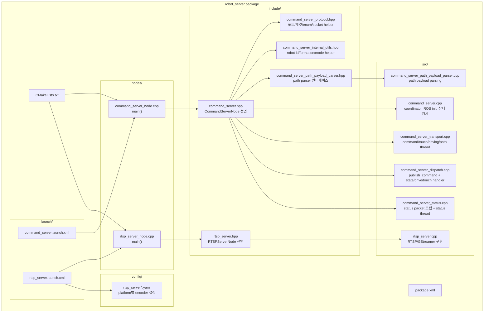
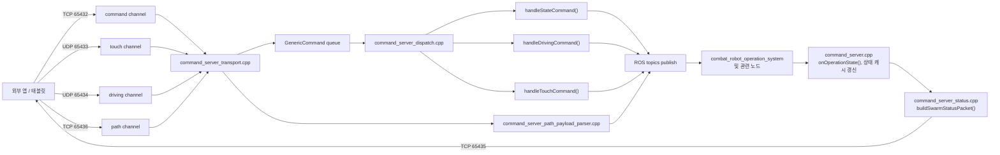

# `robot_server` 구조 요약

> Updated: 2026-04-22

## 1. 패키지 목적

`robot_server`는 크게 두 역할을 맡는다.

- `command_server_node`: 외부 앱/태블릿과 ROS2 사이의 명령/상태 브리지
- `rtsp_server_node`: 카메라 영상을 RTSP로 송출하는 스트리밍 서버

---

## 2. 파일 구조 다이어그램

---

## 3. `command_server` 내부 책임 분리

---

## 4. 파일별 역할 요약

| 파일 | 역할 |
|---|---|
| `nodes/command_server_node.cpp` | `CommandServerNode` 생성 및 `spin()` |
| `include/command_server.hpp` | `CommandServerNode` 클래스 선언, pub/sub, thread, 상태 멤버 선언 |
| `include/command_server_protocol.hpp` | 앱과 주고받는 packed packet, enum, 포트 상수, `SocketGuard` |
| `include/command_server_internal_utils.hpp` | robot id 검증, formation 정규화, 모드 gate helper |
| `include/command_server_path_payload_parser.hpp` | path payload 파서 선언 |
| `src/command_server.cpp` | coordinator 성격의 파일. ROS 초기화, 상태 초기화, aggregate 동기화, callback 처리 |
| `src/command_server_transport.cpp` | 네트워크 수신 thread 구현. command/touch/driving/path 채널 담당 |
| `src/command_server_dispatch.cpp` | 큐에서 꺼낸 명령을 state/drive/touch handler로 분기하고 ROS 메시지로 publish |
| `src/command_server_status.cpp` | 내부 상태를 `SwarmStatusPacket`으로 조립하고 status 채널로 송신 |
| `src/command_server_path_payload_parser.cpp` | path JSON/payload 파싱, waypoint/mission/route 정보 해석 |
| `nodes/rtsp_server_node.cpp` | `RTSPServerNode` 생성 및 `spin()` |
| `include/rtsp_server.hpp` | RTSP 노드 클래스 선언 |
| `src/rtsp_server.cpp` | GStreamer 기반 RTSP 송출 구현 |
| `launch/command_server.launch.xml` | `command_server_node` 실행 launch |
| `launch/rtsp_server.launch.xml` | `rtsp_server_node` 실행 launch |
| `config/rtsp_server_rk3588.yaml` | RK3588 encoder 설정 |
| `config/rtsp_server_rpi.yaml` | Raspberry Pi encoder 설정 |
| `config/rtsp_server_pc.yaml` | PC encoder 설정 |

---

## 5. 현재 구조 해석

- 현재 `command_server.cpp`는 더 이상 모든 네트워크 처리와 패킷 파싱을 직접 들고 있지 않다.
- transport, dispatch, status, path parser가 분리되어 있어서 변경 지점이 비교적 명확하다.
- 아직 `command_server.cpp`에는 lifecycle, ROS callback, swarm 상태 집계 로직이 남아 있으므로 완전히 얇은 coordinator는 아니다.
- 다음 단계 리팩터링 후보는 상태 집계 helper를 별도 `state` 파일로 분리하는 것이다.
