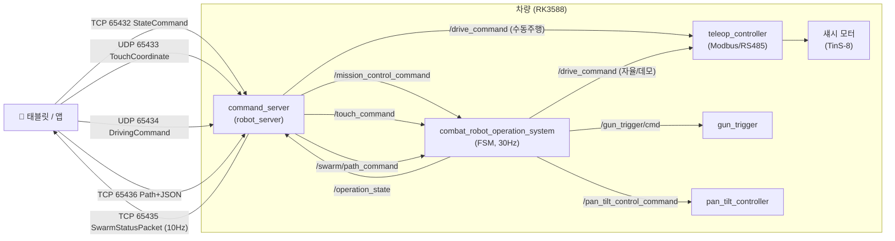
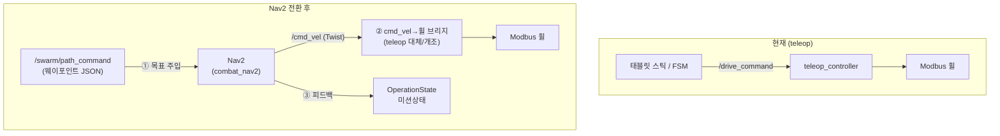

# 태블릿 ↔ 차량 명령/상태 흐름 + Nav2 전환 설계

> Updated: 2026-06-04
> Scope: 태블릿(앱) ↔ 차량 명령/상태 통신 전체 경로 분석 및 `teleop_controller` → Nav2 차량제어 전환 설계
> Audience: 차량제어/통합 담당, Nav2 마이그레이션 작업자

| 관련 문서 | 역할 |
|---|---|
| [`robot_server_structure.md`](robot_server_structure.md) | `robot_server` 패키지 내부 분할 구조 |
| [`app_unified_spec.md`](app_unified_spec.md) | Android 앱 ↔ ROS2 wire protocol |
| [`system_architecture.md`](system_architecture.md) | 시스템 전체 아키텍처(arc42) |

---

## 0. 요약 (TL;DR)

- 태블릿 ↔ 차량의 모든 통신은 **`robot_server`의 `command_server` 노드** 하나가 담당한다(TCP/UDP ↔ ROS2 브리지).
- 차량의 두뇌는 **`combat_robot_operation_system` FSM**이다. 30Hz 타이머로 명령을 소비하고 상태를 발행한다.
- **수동 주행**은 현재 `command_server → /drive_command → teleop_controller(Modbus/RS485)`로 FSM을 우회해 직결된다.
- **Nav2 전환의 핵심**: `teleop_controller`(수동 주행 변환기)를 Nav2 기반 자율주행으로 대체한다. 변경 지점은 ① `/drive_command` 소비자, ② `/swarm/path_command`(웨이포인트) → Nav2 목표 주입, ③ Nav2 피드백 → `OperationState` 미션상태 채우기 — 세 곳이다.

---

## 1. 전체 통신 토폴로지



---

## 2. 포트 / 패킷 맵

진실원천: `robot_server/include/command_server_protocol.hpp` (`#pragma pack(1)` + `static_assert`로 바이트 레이아웃 고정).

| 포트 | 프로토콜 | 방향 | 용도 | 패킷 구조체 | 크기 |
|------|----------|------|------|-------------|------|
| **65432** | TCP | 태블릿→차량 | 모드/PTZ/공격허가/편대/E-Stop | `StateCommand` | 72B |
| **65433** | UDP | 태블릿→차량 | 터치 조준 좌표 | `TouchCoordinate` | 8B |
| **65434** | UDP | 태블릿→차량 | 수동 주행(스틱) | `DrivingCommand` | 2B |
| **65435** | TCP | **차량→태블릿** | 통합 상태 피드백(10Hz) | `SwarmStatusPacket` | 1832B |
| **65436** | TCP | 태블릿→차량 | 미션 경로 LOAD/START/STOP/PAUSE/RESUME | `AssaultCommandHeader`+JSON | 가변 |

각 포트는 `command_server`의 독립 스레드로 동작(`command_server.cpp:111-115`).

---

## 3. 하행: 태블릿 → 차량 (명령)

`command_server`는 수신 소켓 패킷을 ROS 토픽으로 변환해 발행한다(`command_server_dispatch.cpp`).

| 입력 패킷 | 처리 핸들러 | 발행 ROS 토픽 (타입) |
|-----------|-------------|----------------------|
| `StateCommand` (65432) | `handleStateCommand` | `/mission_control_command` (MissionControlCommand)<br/>`/stream_control_command` (StreamControlCommand)<br/>`/swarm/control_command` (SwarmControlCommand) |
| `DrivingCommand` (65434) | `handleDrivingCommand` | `/drive_command` (DriveCommand) |
| `TouchCoordinate` (65433) | `handleTouchCommand` | `/touch_command` (TouchTargetPoint) |
| `Header`+JSON (65436) | `pathServerThread` | `/swarm/path_command` (SwarmPathCommand) |

주요 안전/검증 로직:
- **타깃 필터링**: `selected_robot_ids`에 자기 `robot_id`가 없으면 명령 무시.
- **모드 게이팅(서버측)**: `isModeChangeAllowed`로 현재 FSM 상태에서 허용되는 전환만 통과.
- **공격 승인 핸드셰이크**: `approval_request_id` 매칭으로 stale 응답 무시.
- **경로 검증**: LOAD_PATH 시 payload waypoint 수와 헤더 카운트 일치 검사, mission-capable 모드(RECON/ASSAULT)에서만 START/RESUME 허용.

---

## 4. 차량 두뇌: FSM의 명령 소비

### 4.1 소비 패턴 — "콜백은 저장만, 30Hz 타이머가 소비"

| 단계 | 위치 | 동작 |
|------|------|------|
| 콜백 | `..._callbacks.cpp` | 명령을 멤버 변수에 **래치(저장)**만. 상태전환 없음 |
| 타이머 30Hz | `on_timer()` (`..._state.cpp:1162`) | ① `updateState()` 상태전환 → ② `/operation_state` 발행 → ③ `OperateCombatRobotSystem()` 동작 실행 |

타이머 주기 = `fps_`(기본 30) Hz (`..._system.cpp:202`).

### 4.2 `command_id` → FSM 상태 매핑 (`updateState`, IDLE에서만 진입)

| command_id | run_mode_ | 진입 상태 |
|-----------|-----------|-----------|
| IDLE(0) | RUN_IDLE | IDLE |
| RECON(1) | RUN_MOVING | **MOVE_STATE** |
| PROTECT_GENERAL(2) | RUN_SURVEILLANCE | SURVEILLANCE_STATE |
| PROTECT_DRONE(3) | RUN_DRONE_SURVEILLANCE | DRONE_SURVEILLANCE_STATE |
| DEBUG_ATTACK(4) | RUN_ATTACKING | ATTACKING_STATE |
| DEBUG_TRACKING(5) | RUN_MANUAL_ATTACK | TRACKING_STATE |
| ASSAULT(6) | RUN_ASSAULT | ASSAULT_STATE |
| RETURN_TO_HOME(7) | — | RTH_STATE |

- **우선순위 인터럽트**: 센서에러 → ERROR_STATE, `estop_requested` → EMERGENCY_STOP_STATE (현재 상태 무관).
- **모드 잠금**: 비-IDLE 상태에서는 대개 `IDLE` 수신 시에만 빠져나올 수 있음(이중 안전장치).

### 4.3 명령 필드의 실제 사용처

| 필드 | 소비처 | 동작 |
|------|--------|------|
| `pan_speed`/`tilt_speed` | `pantiltManualControl()` | ±63 클램프, 데드존 10, `/pan_tilt_control_command` 발행 |
| 터치 좌표 | `Attacking_statefunc()` | FOV 기반 atan 변환 → 조준각 |
| `attack_permission` | `handleFireControl()` | APPROVE일 때만 `/gun_trigger/cmd` 발사(안전 인터록) |
| `/swarm/path_command` | `onSwarmPathCommand()` | **현재는 미션 메타상태만 추적**(READY/MOVING/PAUSED), 실제 주행 미구현 |

---

## 5. 상행: 차량 → 태블릿 (상태)

```
FSM /operation_state (OperationState)
  └─► command_server::onOperationState() — 내부 atomic 캐시 갱신
        └─► statusServerThread (10Hz) — buildSwarmStatusPacket()
              └─► TCP 65435 SwarmStatusPacket 송신 ─► 태블릿
```

`SwarmStatusPacket` 구성: 리더 상태(`StatusPacket` + GPS `NavigationStatePacket` + 미션 `MissionPacket`) + 스웜 8대 요약(`RobotAggregateStatus[8]`) + 로그 링버퍼(`RobotLogEntry[16]`) + 공격승인요청.

미션 진행 필드(waypoint index/total/progress/distance)는 FSM이 `fillMissionExecutionStatus()`로 채우며, **현재는 placeholder/더미** 수준이다 → **Nav2 전환 시 실제 값으로 대체 필요**(§6.3).

---

## 6. ★ Nav2 차량제어 전환 설계

> 목표: 차량 주행을 `teleop_controller`(수동 변환기)에서 **Nav2 자율주행 스택**으로 이관. 태블릿/통신/조준/발사 경로는 그대로 유지하고 **주행(섀시 제어) 경로만 교체**한다.

### 6.1 현재 주행 경로 (교체 대상)

`teleop_controller`(`teleop_controller.cpp`)의 역할:
- 구독: `/drive_command`(DriveCommand: `linear_velocity` m/s, `angular_velocity` rad/s)
- **게이팅**: `current_operation_state_ != OperationState::MOVE` 이면 속도를 0으로 강제 — 즉 **MOVE 상태(RECON 모드)에서만 주행**.
- 변환: 차동구동 역기구학 → `speedToRegisterValue()` → Modbus 레지스터 `0x0C`(좌), `0x0D`(우) 쓰기 (RS485, slave 0x01).
- 속도 제한: 직진 ±2.22 m/s, 제자리회전 ±6.0 rad/s, 직진+회전 동시 ±1.5/±4.5.

이중 publisher 구조: `/drive_command`는 ① command_server(수동 태블릿 스틱) ② FSM(자율/데모)가 모두 발행한다.

### 6.2 변경 지점 3곳



**① 경로 주입 — `/swarm/path_command` → Nav2 목표**
현재 `onSwarmPathCommand()`는 메타데이터만 저장한다(`callbacks.cpp:59-100`). 전환 시:
- `CMD_LOAD_PATH`: `path_json`의 웨이포인트(lat/lon)를 파싱해 Nav2 `NavigateThroughPoses`(또는 waypoint_follower) 목표로 변환·보관.
- `CMD_START`/`CMD_RESUME`: Nav2 액션 goal 전송(재개).
- `CMD_PAUSE`: Nav2 주행 일시정지(goal cancel + 위치 유지).
- `CMD_STOP`: goal cancel + 미션 리셋.
- 참고: 기존 메모리상 `combatrobot1(jazzy 호스트) → /swarm/path_command → 차량 nav2(humble)` 경로는 이미 LOAD/START/STOP 검증됨(`combat_nav2` 워크스페이스).

**② 모터 출력 — `/cmd_vel` → 휠 레지스터**
Nav2 컨트롤러는 `geometry_msgs/Twist` `/cmd_vel`을 출력한다. 두 가지 선택지:
- (A) **teleop_controller 개조**: 입력을 `/drive_command`(DriveCommand) → `/cmd_vel`(Twist)로 교체. 차동구동 역기구학·Modbus 출력 로직은 재사용. **권장**(검증된 모터 인터페이스 유지).
- (B) **신규 `cmd_vel`→`drive_command` 브리지** 노드: Nav2 `/cmd_vel`을 DriveCommand로 변환해 기존 teleop 그대로 사용. 변경 최소지만 노드 1개 추가.
- 어느 쪽이든 **수동 주행과 충돌 조정** 필요(아래 §6.4).

**③ 상태 피드백 — Nav2 → `OperationState`**
Nav2의 실제 진행도를 미션 필드로 환산해 FSM이 `/operation_state`로 발행 → command_server → 태블릿:
- `current_waypoint_index` / `total_waypoints`: Nav2 waypoint follower 진행 인덱스.
- `progress_ratio` / `distance_to_next_wp_m` / `distance_to_goal_m`: Nav2 경로 잔여거리에서 계산.
- `mission_status`: Nav2 액션 상태(ACTIVE→MOVING, SUCCEEDED→REACHED, 취소→NONE/PAUSED) 매핑.
- 현재 placeholder(`fillMissionExecutionStatus`, 더미 GPS)를 실측치로 교체.

### 6.3 패킷/메시지 영향 분석

| 항목 | 영향 | 조치 |
|------|------|------|
| 태블릿 wire protocol(`command_server_protocol.hpp`) | **변경 없음** — 패킷 레이아웃 유지 | 그대로 |
| `MissionPacket`/`NavigationStatePacket` 필드 | 기존 필드를 실측치로 채움 | FSM 발행 로직만 수정 |
| `MissionControlCommand`/`SwarmPathCommand` msg | 정의 변경 불필요 | 소비 로직(콜백) 수정 |
| `OperationState::MISSION_*` enum | 그대로 활용 | Nav2 상태→enum 매핑 추가 |

→ **앱/통신 계층은 무수정**으로 가능. 변경은 차량 내부(FSM 콜백 + 주행 노드)에 국한.

### 6.4 주요 의사결정/리스크 (작업 전 확정 필요)

1. **MOVE 게이팅 충돌**: teleop는 `OperationState::MOVE`에서만 주행한다. ASSAULT(자율 미션)는 `ASSAULT_STATE`이므로 현재 로직대로면 **Nav2 주행이 막힌다**. → Nav2 주행 허용 상태(ASSAULT/RTH 등)에서 게이팅을 풀거나, 게이팅 기준을 `mission_status==MOVING`으로 재정의해야 함.
2. **수동 vs 자율 우선권**: 태블릿 스틱(`/drive_command`)과 Nav2(`/cmd_vel`)가 동시에 모터를 노릴 수 있음. mux(예: `twist_mux`) 또는 FSM 상태로 단일 소스 보장 필요.
3. **E-Stop 경로**: estop은 즉시 모터 정지를 보장해야 함 — Nav2 goal cancel + 휠 0 출력을 estop 인터럽트에서 강제(현 EMERGENCY_STOP_STATE 로직과 연동).
4. **좌표계**: 경로 JSON은 GPS(lat/lon), Nav2는 map/odom 프레임. navsat_transform/GNSS 변환 정합 필요(`combat_nav2`의 GNSS 안정화 작업과 연계).
5. **humble↔jazzy DDS 호환**: 호스트(jazzy)↔차량(humble) 통신은 cyclonedds 호환 이슈가 있음 — nav2(C++) 토픽은 정상이나 rclpy/ros2cli generic은 주의.

### 6.5 권장 작업 순서

1. `teleop_controller`를 `/cmd_vel`(Twist) 입력으로 개조(§6.2-A), MOVE 게이팅 재정의(§6.4-1).
2. `onSwarmPathCommand`에 Nav2 액션 클라이언트 연동: LOAD→경로보관, START/RESUME→goal, PAUSE/STOP→cancel(§6.2-①).
3. Nav2 피드백 → `mission_execution_state_` 실측치 반영 → `/operation_state` 발행(§6.2-③).
4. estop·수동/자율 mux 안전로직(§6.4-2,3).
5. 시뮬(`bringup_sim`) → 실차 순으로 LOAD/START/STOP/PAUSE/E-Stop 시나리오 검증.

---

## 7. 참고 코드 위치

| 기능 | 파일:라인 |
|------|-----------|
| 포트/패킷 정의 | `robot_server/include/command_server_protocol.hpp` |
| 소켓 수신 스레드 | `robot_server/src/command_server_transport.cpp` |
| 명령→ROS 변환 | `robot_server/src/command_server_dispatch.cpp` |
| 상태→패킷 송신 | `robot_server/src/command_server_status.cpp` |
| 차량상태 수신 | `robot_server/src/command_server.cpp:614 onOperationState` |
| FSM 명령 콜백 | `combat_robot_operation_system/src/..._callbacks.cpp` |
| FSM 상태전환 | `combat_robot_operation_system/src/..._state.cpp:838 updateState` |
| FSM 메인루프 | `combat_robot_operation_system/src/..._state.cpp:1162 on_timer` |
| 발사 제어 | `combat_robot_operation_system/src/..._control.cpp:294 handleFireControl` |
| 수동 PTZ | `combat_robot_operation_system/src/..._control.cpp:505 pantiltManualControl` |
| **주행 모터 출력(교체대상)** | `teleop_controller/src/teleop_controller.cpp:113 on_cmd_vel` |
