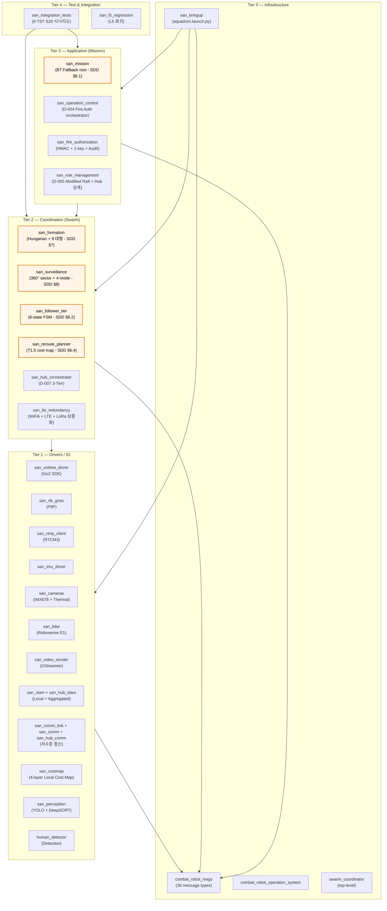
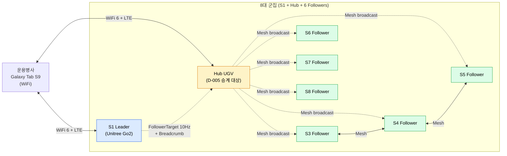
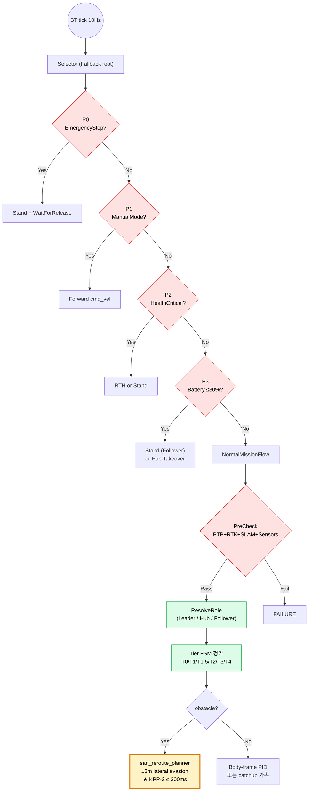
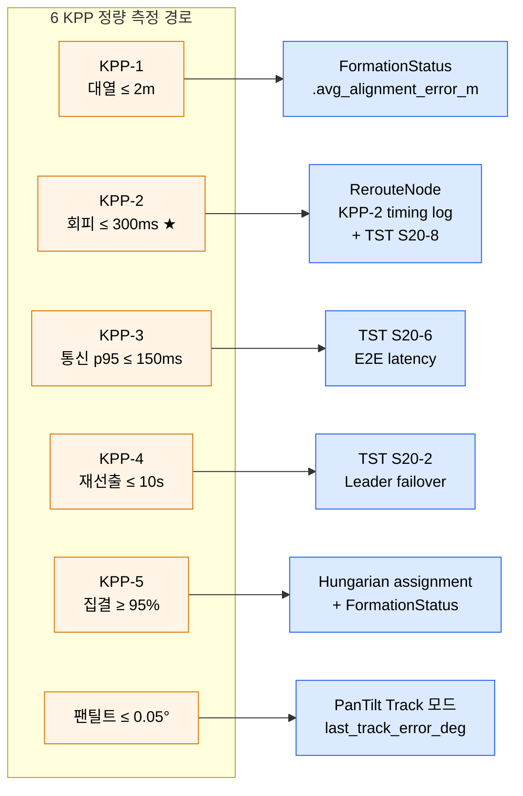

# SAN v1.5 — 시스템 아키텍처 명세서

> **문서 ID**: SAN-PDR-ARCH-001 Rev.A
> **목적**: PDR 평가 시 제시할 시스템 구조도 + 패키지 의존성 + 메시지 흐름
> **권원**: SDD-SWARM v1.5, IDS-CMD v1.5, DCN-2026-001/-002
> **범위 제한**: **Soft Kill (RF 재머) 제외** — JammingCommand 메시지 정의는 존재하나 실 사용처 없음

---

## 1. 4-Tier 시스템 아키텍처

**주황색 = PDR 준비 단계에서 신설 / 확장**

---

## 2. 군집 8대 역할 아키텍처

| 역할 | 대수 | 핵심 책임 |
|---|---|---|
| **Leader (S1)** | 1 | Unitree Go2, FollowerTarget broadcast, 대형 결정 |
| **Hub UGV** | 1 | D-005 Leader 승계 대상, SLAM 통합, 비디오 중계 |
| **Followers** | 6 | 자율 추종 + 360° sector 감시 |

D-005 Modified Raft: Leader 사망 시 Hub 가 **4-tier 우선순위** 로 승계 (1순위: 직전 LeaderID, 2: 최저 ID, 3: 최고 SLAM 건강도, 4: 최고 battery%).

---

## 3. SDD §6 BT + 5-Tier 자율 회피 흐름

---

## 4. KPP 측정 인프라 — 6/6 측정 가능 ✅

---

## 5. Soft Kill 제외 — 명시적 처리

본 시스템에서 **RF 재머를 활용한 Soft Kill 은 현재 개발 범위 외**. 영향:

| 항목 | 처리 |
|---|---|
| `JammingCommand.msg` (IDS §3.4) | 메시지 정의는 유지 (legacy compatibility) |
| RF 재머 제어 노드 | **신규 패키지 생성 없음** |
| Soft Kill BT 액션 | **NormalMissionFlow 에 분기 없음** |
| Surveillance Engage 모드 | **Hard Kill 사격 표적 추적 전용** |
| 드론 무력화 경로 | **Hard Kill 만**: san_perception → san_surveillance Track → san_fire_authorization (D-004) |

---

## 6. 거버넌스 정합

| DCN | 영향 | 정합도 |
|---|---|---|
| DCN-2026-001 D-004 | Fire Auth HMAC + 2-key + Audit | **100%** ✅ |
| DCN-2026-001 D-005 | 4-Tier Leader 승계 | **100%** ✅ |
| DCN-2026-002 D-007 | 3-Tier C++/rclpy 분리 | **100%** ✅ |
| DCN-2026-002 D-008 | IPC 통일 (multiprocessing→0, ShmPool→0) | **100%** ✅ |
| DCN-2026-002 D-009 | 메트릭 목표 달성 | **100%** ✅ |
| ADR-006 | IPC 통일 전략 | **100%** ✅ |
